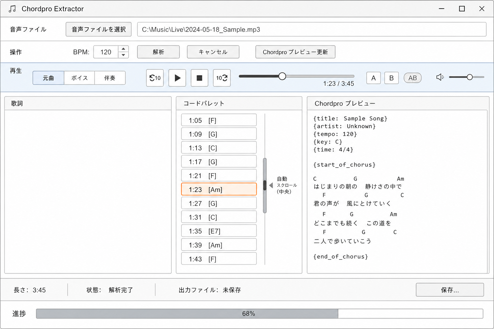

# 音声再生 UI 設計

解析済みの曲を聴きながらコードを挿入するための再生バー仕様です。実装は `AudioPlaybackService` と `MainWindow` の再生行にあります。

## 画面配置

操作バー（解析）と 3 列エディタの **間**に再生バー行を挿入します。

## コントロール

| 要素 | 仕様 |
|------|------|
| **音源** | セグメント型 3 択: **元曲**（既定） / **ボイス** / **伴奏** |
| **◀10s / 10s▶** | 現在位置 ±10 秒（0〜曲末にクランプ） |
| **▶ / ❚❚** | 再生 / 一時停止（続きから再開） |
| **■** | 完全停止 → 位置 0 |
| **シーク** | スライダー + 現在時刻 / 総尺表示 |
| **A / B / AB** | ループ開始・終了のマーク、AB トグルで区間リピート |
| **音量** | 0〜1（設定に永続化） |
| **速度** | 50% / 75% / 80% / 90% / 100%（**1.0 超は不可**。設定に永続化） |

### 音源の有効化

- **元曲**: ファイル選択直後から有効（選択した MP3/WAV）
- **ボイス / 伴奏**: Demucs の `vocals.wav` / `no_vocals.wav` が解決できるとき（解析成功後、またはキャッシュヒット時）

音源切替時は現在の秒数を維持します。再生中は差し替え後も継続します。

## 再生 / 一時停止 / 停止

| 操作 | 挙動 |
|------|------|
| 再生 | 停止状態なら先頭から、一時停止後は **同じ秒数から** 再開 |
| 一時停止 | 位置を保持 |
| 停止 | 位置 0、デバイス停止 |

## AB リピート

1. 現在位置で **A** → ループ開始
2. 別位置で **B** → ループ終了（B ≤ A のときは入れ替え）
3. **AB** ON → `position >= B` で `position = A`
4. **AB** OFF → 通常再生
5. ファイル変更時は AB マーカーをクリア。停止時はマーカーを保持

## キーボードショートカット

歌詞ペインにフォーカスがあるときも、ウィンドウの `PreviewKeyDown` で有効です（解析処理中は無効）。

| キー | 操作 |
|------|------|
| **Shift+Space** | 再生 / 一時停止 |
| **F5** | 再生 / 一時停止（代替） |
| **F4** | 再生位置のコードを歌詞キャレットへ挿入 |
| **F3** | −10 秒 |
| **F6** | +10 秒 |

エルゴノミックキーボード（例: Logitech Ergo K860）では、F3（左 F ブロック）と F6（右 F ブロック）で ±10 秒、F4/F5 で挿入・再生を左手寄りに操作する想定です。ノート PC では **Fn** 併用になる場合があります。

## 歌詞ペイン「現在のコード」

歌詞列ヘッダ右に `▶ 現在: [Am]  1:23` 形式で表示します。F4 はこの表示と同じコードを挿入します。

## コードパレット連動

- 各 `ChordPaletteItemVm` に `Seconds`（Chordino 時刻）を保持
- 再生位置更新時（約 100 ms）: `Seconds <= currentPosition` を満たす **最後の行** を `IsActive = true`
- Active 行は **青灰の行ハイライト**（ホバーに近い `#D6E8F5`、左アクセント `#1976D2`）。変更時に `ListBox.ScrollIntoView`
- クリックまたは **F4** で歌詞へ `[chord]` 挿入

## 技術

- **NAudio** `WaveOutEvent` + `AudioFileReader`
- UI 更新は `DispatcherTimer`
- stem パスは `ConvertPipelineResult.DemucsWorkDir` または `DemucsWorkCache.TryFindReusableWorkDir`
- Demucs キャッシュは `RecordCacheAccess` で最終利用を更新（解析・ファイル選択・再生開始）
- 速度変更は `PlaybackRateSampleProvider`（ピッチも下がるテープ式）

## 将来案（未実装）

- シークバー上の A/B マーカー表示
- コード行ダブルクリックでその秒数へシーク
- パレット「再生位置に追従」トグル
